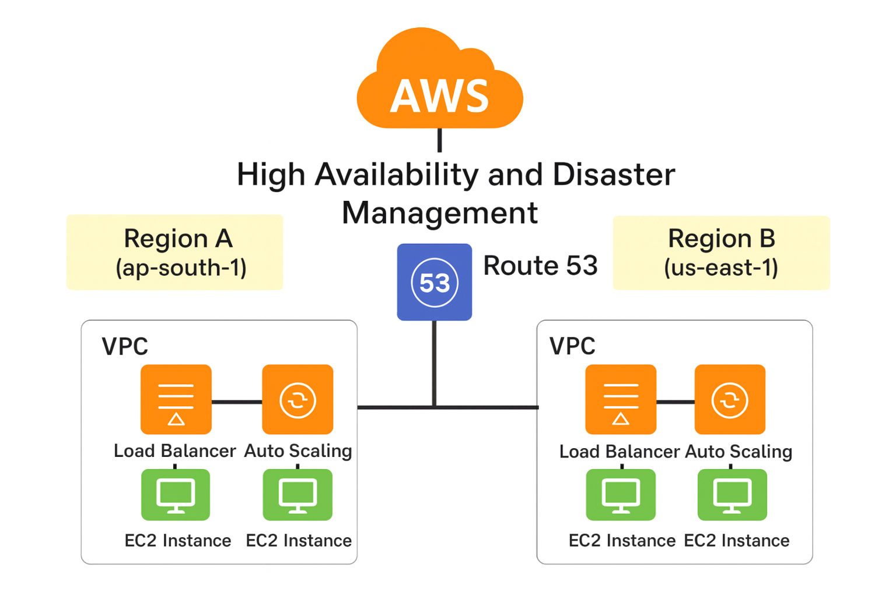

# High Availability & Disaster Recovery (HA/DR) on AWS

## 📌 Project Overview
This project demonstrates a High Availability (HA) and Disaster Recovery (DR) architecture on AWS using a multi-region deployment.

- Primary Region: ap-south-1 (Mumbai)
- DR Region: us-east-1 (N. Virginia)
- Traffic Management: Amazon Route 53 (DNS Failover)

## 🏗 Architecture Diagram

## 📘 Setup Guide
Refer to the detailed setup instructions:
👉 ./setup-guide.md
